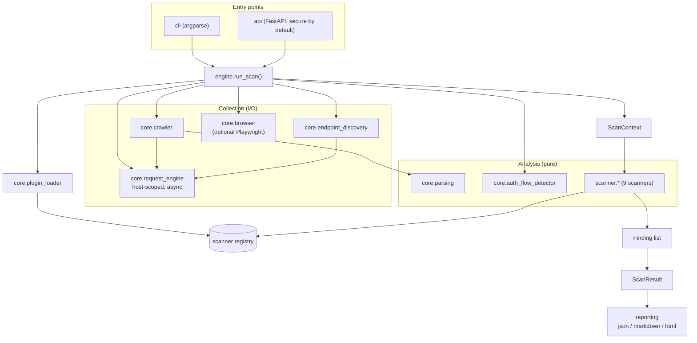
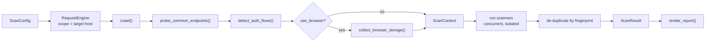
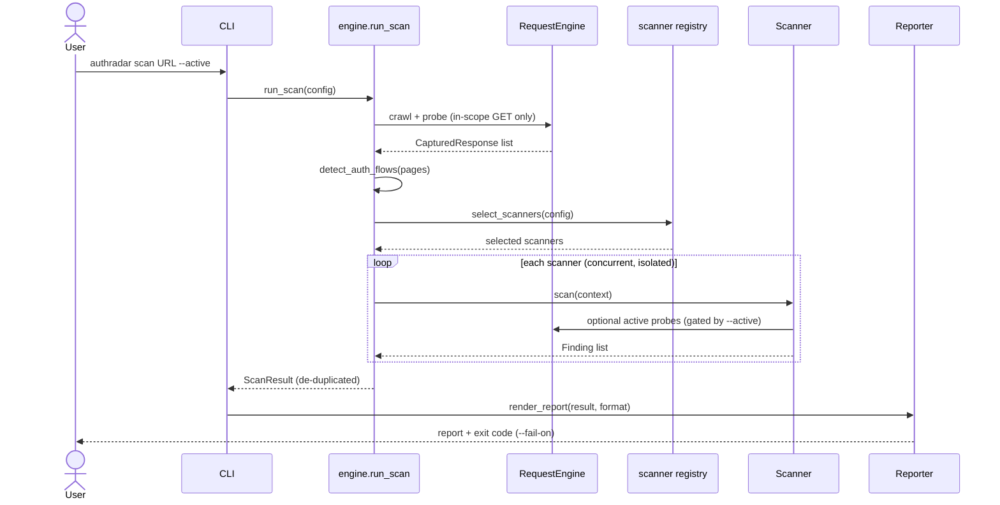
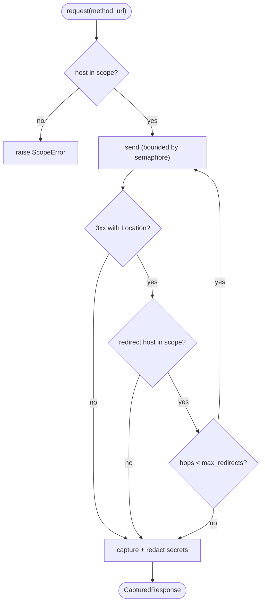
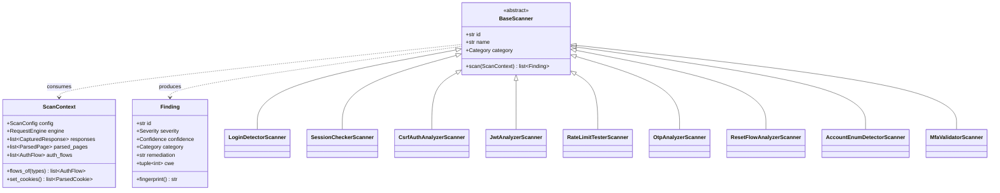
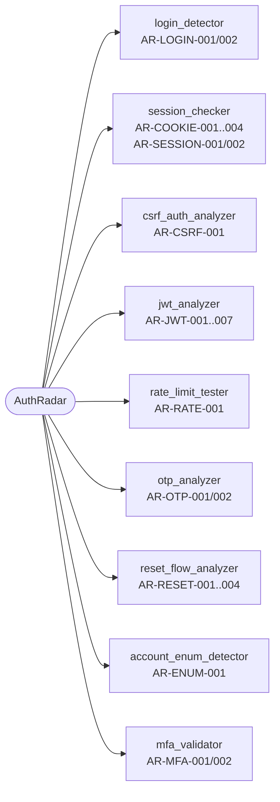

# AuthRadar

**AuthRadar** is an asynchronous authentication-security auditing framework for
modern web applications. Point it at an application you are authorized to test
and it will crawl the site, discover authentication flows (login, registration,
password reset, OTP/MFA, OAuth, logout), and run a suite of modular scanners
that detect common authentication and session-management weaknesses.

It is built around a clean separation between **I/O (collection)** and **pure
analysis (detection)**, which makes the detection logic deterministic and
thoroughly unit-tested.

> ⚠️ **Authorized use only.** AuthRadar sends real (bounded) HTTP traffic to its
> target, including optional active probes such as repeated failed logins. Only
> scan systems you own or have **explicit written permission** to test.
> Unauthorized scanning may be illegal.

---

## Highlights

- **Async-first** architecture built on `httpx` and `asyncio`.
- **Host-scoped request engine** that refuses to follow redirects off the
  authorized host (defence against scope-escape / SSRF).
- **Passive by default**; active probes (rate-limit, OTP, enumeration, MFA) are
  opt-in via `--active`.
- **Pluggable scanners** discovered via a registry and Python entry points.
- **Multiple report formats**: JSON (for CI), Markdown, and self-contained HTML.
- **Fully typed** (`py.typed`, `mypy --strict`) and linted (`ruff`).

## What it detects

| Area | Checks (IDs) |
| --- | --- |
| Transport / login | Cleartext login (`AR-LOGIN-001`), GET-based login (`AR-LOGIN-002`) |
| Cookies / session | Missing `Secure` / `HttpOnly` / `SameSite` (`AR-COOKIE-001..003`), `SameSite=None` without `Secure` (`AR-COOKIE-004`), session fixation (`AR-SESSION-001`), broken logout invalidation (`AR-SESSION-002`) |
| CSRF | Missing CSRF protection on auth forms (`AR-CSRF-001`) |
| JWT / tokens | `alg=none` (`AR-JWT-001`), missing/long expiry (`AR-JWT-002/003`), sensitive claims (`AR-JWT-004`), token in localStorage/sessionStorage (`AR-JWT-005/006`), token leaked in URL (`AR-JWT-007`) |
| Rate limiting | Missing login rate limiting / brute-force exposure (`AR-RATE-001`) |
| OTP | Too-short OTP (`AR-OTP-001`), missing OTP rate limiting (`AR-OTP-002`) |
| Password reset | Weak token (`AR-RESET-001`), token replay (`AR-RESET-002`), long-lived token (`AR-RESET-003`), sequential tokens (`AR-RESET-004`) |
| Account enumeration | Username/account enumeration via response differences (`AR-ENUM-001`) |
| MFA | MFA bypass after first factor (`AR-MFA-001`), broken step validation (`AR-MFA-002`) |

See [`docs/checks.md`](docs/checks.md) for full descriptions, severities, CWE
mappings, and remediation guidance.

## Installation

Requires **Python 3.12+**.

```bash
python -m venv .venv
source .venv/bin/activate          # Windows: .venv\Scripts\activate
pip install -e .                    # or: pip install -r requirements.txt
```

Browser-based checks (JWT in web storage) additionally need a Playwright
browser binary:

```bash
playwright install chromium
```

## Quick start

```bash
# Passive audit, Markdown report to stdout
authradar scan https://example.com

# JSON report to a file, fail the build on HIGH+ findings
authradar scan https://example.com --format json -o report.json --fail-on high

# Enable active probes (authorized targets only) with credentials you own
export AUTHRADAR_PASSWORD='your-password'
authradar scan https://example.com \
  --active \
  --username alice \
  --protected-path /account \
  --logout-path /logout

# List the available scanners
authradar list-scanners -v
```

Exit codes: `0` = no findings at/above the `--fail-on` threshold, `1` = findings
at/above threshold, `2` = configuration or scan error.

### Programmatic use

```python
import asyncio

from authradar.core.config import ScanConfig
from authradar.engine import run_scan
from authradar.reporting import render_report


async def main() -> None:
    config = ScanConfig(target="https://example.com")
    result = await run_scan(config)
    print(render_report(result, "markdown"))


asyncio.run(main())
```

### HTTP API (optional)

AuthRadar ships an optional FastAPI server. It is **secure by default**: the
`/scan` endpoint is disabled until you set an API key.

```bash
export AUTHRADAR_API_KEY='a-long-random-secret'
authradar serve --host 127.0.0.1 --port 8000
# POST /scan with header  X-API-Key: a-long-random-secret  and a ScanConfig body
```

## Docker

```bash
docker build -t authradar .
docker run --rm authradar scan https://example.com
```

## Architecture

```
authradar/
  core/        models, config, request engine, crawler, discovery, plugin loader
  scanner/     one module per detection family (pure analysis + async collection)
  reporting/   JSON / Markdown / HTML reporters
  cli/         argparse entry point and command implementations
  api.py       optional FastAPI server
  engine.py    scan orchestration
```

### Component map

How the packages fit together. Collection components perform all I/O; analysis
components are pure functions over captured data.



### Scan pipeline (data flow)



### Scan sequence



### Request engine: scope enforcement

Scope is re-checked on every redirect hop, so an attacker-controlled redirect
cannot escape the authorized host (defence against scope-escape / SSRF).



### Scanner plugin model

Every scanner is a `BaseScanner` subclass registered in the registry; it
consumes a `ScanContext` and produces immutable `Finding` objects.



### Scanner & check coverage



> Tip: GitHub renders these Mermaid diagrams automatically. To preview locally,
> use any Mermaid-aware Markdown viewer (for example the VS Code Markdown
> preview with a Mermaid extension).

See [`docs/architecture.md`](docs/architecture.md) and
[`docs/writing-plugins.md`](docs/writing-plugins.md).

## Development

```bash
pip install -e ".[dev]"

ruff check .
ruff format --check .
mypy authradar tests
pytest
bandit -r authradar -c pyproject.toml
pip-audit -r requirements.txt
```

## Contributing

Contributions are welcome! Start with [`CONTRIBUTING.md`](CONTRIBUTING.md) and the
[developer guide](docs/development.md). By participating you agree to our
[Code of Conduct](CODE_OF_CONDUCT.md).

- Report bugs or propose checks via the issue templates.
- Please read [`SECURITY.md`](SECURITY.md) for how to report vulnerabilities
  responsibly and for AuthRadar's defensive-use policy.
- Release notes live in [`CHANGELOG.md`](CHANGELOG.md).

## License

[MIT](LICENSE) © AuthRadar Contributors.
